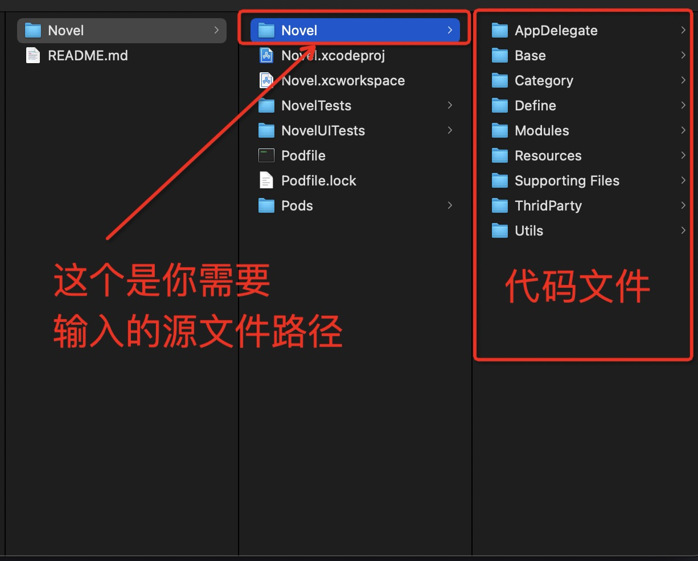

# CodeBuilder
自动修改/翻新/混淆/OC/iOS代码，自动替换类名，方法名

## 由来

网上有很多关于如何混淆iOS源码的方法，但是都不够智能，生成的方法类名要么千奇百怪，要么aaaabbbxxx这种完全毫无意义的名称，要么只能修改单个文件，多个文件根本无法关联，我就想有什么方法可以像真人一样去修改源码，符合语义，不是胡编烂造的方法名，还可以自动修改相关联的文件, 还能自己自定义单词库，于是就有了这个app

>划重点
#### 1. 该工具可以让你一键翻新代码，但是不是生成完整的xcode项目，需要你自己新建一个xcode项目，然后把翻新的文件拖入到新的项目中。
#### 2. 该工具只支持Object-C, 如果反响好的话，考虑添加swift或者其他语言支持.


>几个效果展示


## 使用说明

##### 下载项目，或者git clone, 安装 Code Builder.dmg


<!-- #### 视频演示
<video id="video" controls="" preload="none" poster="http://img.blog.fandong.me/2017-08-26-Markdown-Advance-Video.jpg">
      <source id="mp4" src="http://img.blog.fandong.me/2017-08-26-Markdown-Advance-Video.mp4" type="video/mp4">
      </video> -->

#### 注意：
##### 说明中提到的路径均为绝对路径，提到的逗号```,```都为英文逗号。使用工具运行成功后，需要自己新建OC项目再将修改后的代码与资源文件拖入新建的工程。
##### 功能说明：
###### 
    1.自动修改Object-C类名，方法名。
    2.自动添加类名前缀，后缀。
    3.自动修改分类，自定义是否修改分类。
    4.自动过滤系统方法与自定义方法。
    5.混淆图片资源，自动添加md5值。
    6.可自定义混淆字库。
    7.自定义修改范围，提供多种规则选择，让修改更便捷。
    8.自动添加介词，使生成的名称更符合语义。
    9.自定义后缀规则。
    10.自动添加源码注释。
    11.支持配置文件设置，对程序员更友好。
    12.自定义想要过滤的方法，直接贴上方法名，系统自动解析。
##### 未来可能添加的功能：
######
    1.随机生成全局属性前缀，例如将_下划线修改为self.,或者将self.修改为下划线。
    2.属性定义顺序进行随机。
    3.类定义顺序进行随机处理。
    4.方法定义进行随机处理。
    5.枚举顺序进行随机处理。
    6.头文件import顺序进行随机处理。
    7.静态常量定义顺序进行随机处理。
    8.宏定义顺序进行随机处理。
    9.interface类声明顺序进行随机处理。
    10.extentsion扩展顺序进行随机处理。
    11.代理声明顺序进行随机处理。
    12.block声明顺序进行随机处理。
##### 说明文档会不定期更新，如遇到问题先检查是否依照说明文档的定义进行配置。

#### 1. 源文件路径/import_path（必选） 
   ###### OC项目文件路径包含代码文件与资源文件
   ##### 如下图
   

#### 2. 导出路径/export_path（必选）
   ###### OC项目导出路径。
   ###### 注意，本工具并不能帮你生成完整的OC项目，只会生成OC代码文件和复制修改项目内部的资源

#### 3. 直接复制的路径/copy_only_pathes（可选）
   ###### 修改后的代码导出路径

#### 4. 直接复制的文件名(不包含后缀)/copy_only_names（可选）
   ###### 直接复制，忽略的文件名，不包含后缀
   ##### 例：UISheetView.h 只需要输入UISheetView，多个文件用 ```,``` 逗号隔开（注意全半角，逗号为英文逗号）

#### 5. 不进行修改的文件或文件夹/no_change_pathes（可选）
###### 深度读取，但是不会进行更改，如果引入了其他修改了的类，会相应的修改
##### 深度读取（说明）：会读取文件内部的类比与项目内其他类进行关联
##### 例：xxxx/Classes/Models 不想修改，则输入这个文件夹的绝对路径, 如只输入Models,则所有包含名为Models的文件或文件夹都会标记为只读取不修改，多个文件和类用```,``` 逗号隔开（注意全半角，逗号为英文逗号）

#### 6. 不修改的文件或类的前缀名(区分大小写)/no_change_class_prefix_names（可选）
   ##### 例：不想所有以MJ开头的类或文件，则输入MJ, 多个文件和类用```,``` 逗号隔开（注意全半角，逗号为英文逗号）

#### 7. 不修改的文件后缀名(区分大小写)/no_change_class_prefix_names （可选）
   ###### 如第六条。Model,Info -->不修改以Model,Info为结尾的文件或类

#### 8. 只修改类名的文件名或类名/only_change_clsname_names （可选）
   ###### 深度读取，只修改类名，不修改内部属性与方法，这个优先级最低，如果之前的条件包含了本参数中的路径，则不生效

#### 9. 只修改类名的文件夹/文件路径/only_change_clsname_pathes （可选）
   ###### 深度读取，只修改类名，不修改内部属性与方法的文件名，这个优先级最低，如果之前的条件包含了本参数中的路径 则不生效

#### 10. 动词词库路径/verbwords_path （可选）
###### 提供单词数组json文件路径\n修改的命名逻辑为ABAB型，A为动词，B为名词，
##### 例：getMessage

#### 11. 名词词库路径/nounwords_path （可选）
###### 提供单词数组json文件路径\n修改的命名逻辑为ABAB型，A为动词，B为名词，
##### 例：getMessage

#### 12. 类名前缀/class_prefix （可选）
###### 给每个类添加的前缀
##### 例：MJExtension--> MJ 为前缀， SD_ScrollView--> SD_ 为前缀

#### 13. 属性名前缀/property_prefix （可选）
###### 给每个属性添加的前缀
##### 例：property(nonatomic, strong) UIView *MJView --> MJ 为前缀， property(nonatomic, strong) UIView *SD_View --> SD_ 为前缀

#### 14. 需要过滤的方法路径/filter_methods_path （可选）
###### 把你需要过滤的方法写入一个文本文件，然后将该文本路径填入到此项输入框
##### 注意事项:
    1.确保填入的每个方法以';'分号结尾
    
    2.每一行只有一个方法
    
    格式示例：
    
    - (void)tableView:(UITableView *)tableView didSelectRowAtIndexPath:(NSIndexPath *)indexPath;
    - (CGFloat)tableView:(UITableView *)tableView heightForFooterInSection:(NSInteger)section;
    - (instancetype)initWithName:(NSString *)name content:(NSString *)content isPublic:(BOOL)isPublic; 
    
    
##### 其他说明：本工具已经过滤了大多数常用系统方法，大部分情况下不需要配置此项。
    
#### 15. 类名和属性名后缀路径/property_subfix_path （可选）
###### 给每个属性添加的后缀，需要一个配置json文件路径
##### json格式：
    [
    {"UITableView":{"class":["TableView", "TabView"], "property":["TableView", "TBView", "TView"]}},
    {"UICollectionView":{"class":["CollectionView", "ColView"], "property":["ColView", "CollectView", "CTView"]}},
    {"UIView":{"class":["View", "V"], "property":["View", "Vw", "Vi"]}}
    ]
##### 注意：key一定要与上面一直，否则系统无法读取，工具会遍历数组，为对应的类匹配后缀，在配置改文件时，包含相同字符串的类，需要将类名更长的类放在前面，不然匹配结果会达不到预期。
##### 例如：UITableView与UIView，配置时需要将UITableView放在View之前，如上面的例子。
    
#### 16. 为方法名添加介词/add_preposition （可选）
###### 工具内置了所有介词，可选择性添加
##### 例：getMessage添加介词后---> getAMessage or getTheMessage
##### 具体介词完全随机添加

#### 17. 修改分类/change_category （可选）
###### 工具会自动识别分类，可选择是否修改

#### 18. 将原代码行作为注释写入/add_original_comments （可选）
###### 由于本工具不保证修改后百分百不报错，将修改过原属性声明和方法名作为注释写入，方便在重建工程后报错与原工程进行对照，建议设置

#### 19. 修改方法内部局部变量名/change_local_property （可选）
###### 定义在方法内部的局部变量，可选择是否修改

#### 20. 综合配置路径 （可选）
###### json配置文件路径，内部必须为字典，key为说明条目标题后面的英文
##### 请注意：配置文件优先级高于输入框输入的规则，配置文件存在时, 输入框输入的配置不生效
##### 例：(可直接复制修改)
    {
    "import_path": "",
    
    "export_path": "",
    
    "copy_only_pathes": "",
    
    "copy_only_names": "",
    
    "no_change_pathes": "",
    
    "no_change_class_subfix_names": "",
    
    "no_change_class_prefix_names": "",
    
    "only_change_clsname_pathes": "",
    
    "only_change_clsname_names": "",
    
    "change_category": true,
    
    "add_original_comments": true,
    
    "class_prefix": "",
    
    "property_prefix": "",
    
    "add_preposition": true,

    "change_local_property": true,
    
    "verbwords_path": "",
    
    "nounwords_path": "",
    
    "filter_methods_path": "",
    
    "property_subfix_path": ""
    
    }
    
#### 20. 关于bug
###### 虽然工具本身经过了完整的商业项目的考验，但由于每个人的代码风格不一样，工具不可避免会出现解析不了的情况，开发者建议过滤C语言的文件，与第三方库，减少出错的可能性，还是无法运行成功，你可以将源码与问题发到feedback_iOS@yeah.com，或根据报错Log自行删减项目文件，其中利弊，自行斟酌。
