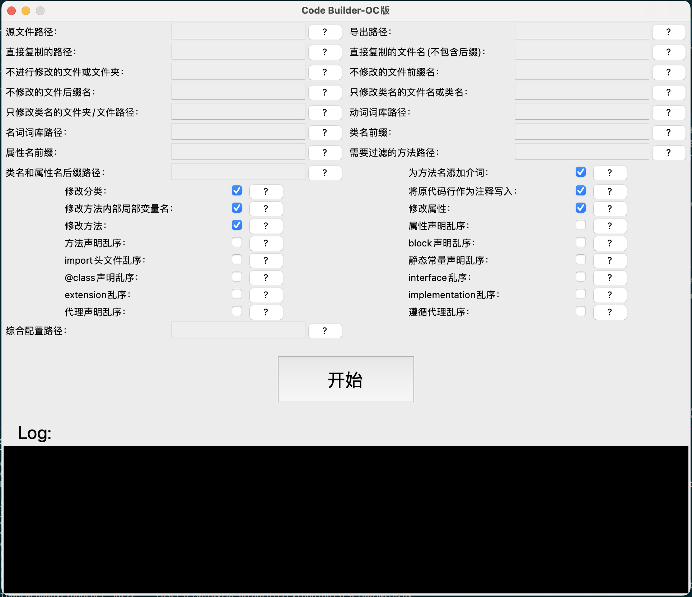
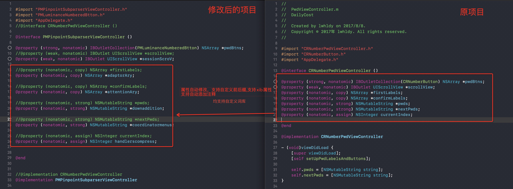
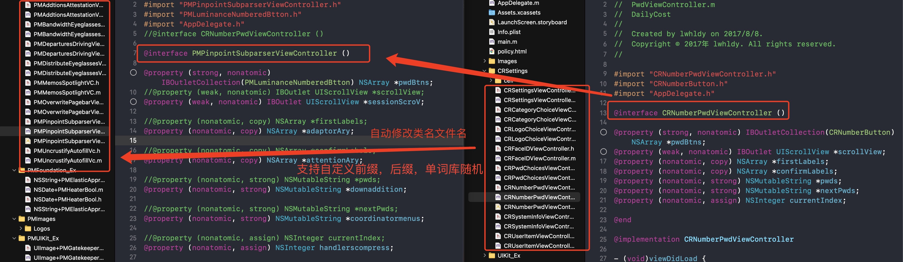
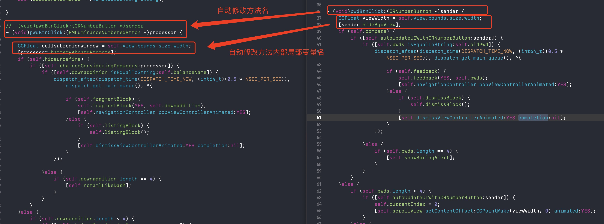
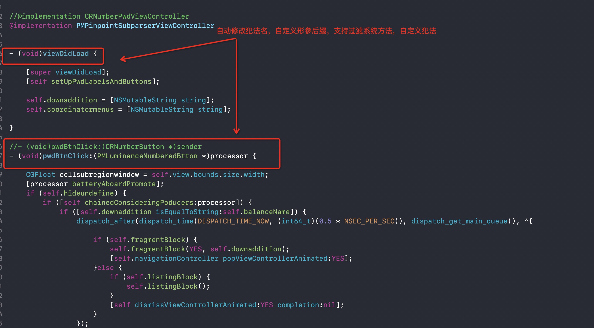
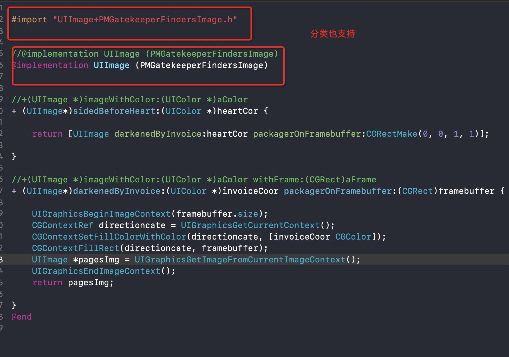

# CodeBuilder
自动修改/翻新/混淆/OC/iOS代码，自动替换类名，方法名
# 更新日志
> ### Version: 1.4
### 新增:
#### 1.修改图片资源MD5值
> ### Version: 1.3
### 修复：
#### 1.修复勾选静态常量乱序时，修改无效的bug
# 更新日志
> ### Version: 1.2
### 新增：
#### 1.支持修改属性全局开关
#### 2.支持修改方法全局开关
#### 3.支持属性声明顺序随机
#### 4.支持方法声明顺序随机
#### 5.支持同文件内部多个类声明是顺序随机（指：@class xxxx）
#### 6.支持头文件import顺序随机
#### 7.支持静态常量定义顺序随机
#### 8.支持interface类声明顺序随机
#### 9.支持extentsion扩展声明顺序随机
#### 10.支持implementation扩展声明顺序随机
#### 11.支持代理声明顺序随机
#### 12.支持block声明顺序随机
#### 13.支持遵循代理顺序随机

### 修复：
#### 1.修复方法返回值带```*```时```*```号重复写入的问题
#### 2.修复只修改类名的文件夹路径输入框与只修改类名文件名输入框配置互调的问题
#### 3.修复到方法返回值不为void时，勾选源代码注释无效果的问题
#### 4.修复任务完成时，Log依然显示"进程被终止..."的问题


> ### Version: 1.1 
#### 1.修复当文件到达一定量级后，某些情况下数组越界导致程序崩溃的问题
#### 2.修复当block属性申明不规范时解析失败的问题
#### 3.修复当方法返回值为block时解析不正确的问题
#### 4.修复反复点击开始/停止显示不符合预期的问题
#### 5.修复在macOS12.3上UI显示不完整的问题
#### 6.其他细节修改和优化

> ## 由来

网上有很多关于如何混淆iOS源码的方法，但是都不够智能，生成的方法类名要么千奇百怪，要么aaaabbbxxx这种完全毫无意义的名称，要么只能修改单个文件，多个文件根本无法关联，我就想有什么方法可以像真人一样去修改源码，符合语义，不是胡编烂造的方法名，还可以自动修改相关联的文件, 还能自己自定义单词库，于是就有了这个工具。

>划重点
#### 1. 该工具可以让你一键翻新代码，但是不是生成完整的xcode项目，需要你自己新建一个xcode项目，然后把翻新的文件拖入到新的项目中。
#### 2. 该工具只支持Object-C, 如果反响好的话，考虑添加swift或者其他语言支持.
#### 3.目前免费使用，免费使用，免费使用，重要的事情说三遍
#### 4.因为GUI由Python编写，部分电脑上打开程序会慢一些或无反应，请多点击几次，耐心等待片刻，GUI不影响代码解析速度。
#### 5.软件开始运行时会清空目标文件夹内所有文件，请务必新建文件夹作为导出路径。
#### 6.虽然工具内置词库，但还是强烈建议配置自己的词库，达到最优的混淆效果。


>几个效果展示











## 使用说明

### 下载项目，或者git clone, 安装 Code Builder.dmg


# [演示视频](https://www.bilibili.com/video/BV1ib4y1y7CD/)

#### 注意：
##### 说明中提到的路径均为绝对路径，提到的逗号```,```都为英文逗号。使用工具运行成功后，需要自己新建OC项目再将修改后的代码与资源文件拖入新建的工程。
##### 功能说明：
###### 
    1.自动修改Object-C类名，方法名。
    2.自动添加类名前缀，后缀。
    3.自动修改分类，自定义是否修改分类。
    4.自动过滤系统方法与自定义方法。
    5.混淆图片资源，自动添加md5值。
    6.可自定义混淆字库。
    7.自定义修改范围，提供多种规则选择，让修改更便捷。
    8.自动添加介词，使生成的名称更符合语义。
    9.自定义后缀规则。
    10.自动添加源码注释。
    11.支持配置文件设置，对程序员更友好。
    12.自定义想要过滤的方法，直接贴上方法名，系统自动解析。
    13.支持修改属性全局开关
    14.支持修改方法全局开关
    15.支持属性声明乱序
    16.支持方法声明乱序
    17.支持同文件内部多个类声明是乱序（指：@class xxxx）
    18.支持头文件import乱序
    19.支持静态常量定义乱序
    20.支持interface类声明乱序
    21.支持extentsion扩展声明乱序
    22.支持implementation扩展声明乱序
    23.支持代理声明乱序
    24.支持block声明乱序
    25.支持遵循代理乱序
##### 未来可能添加的功能：
######

   1.随机生成全局属性前缀，例如将_下划线修改为self.,或者将self.修改为下划线。
   ~~2.属性定义顺序进行随机~~<br>
    ~~3.类定义顺序进行随机处理。~~<br>
    ~~4.方法定义进行随机处理。~~<br>
    5.枚举顺序进行随机处理。<br>
    ~~6.头文件import顺序进行随机处理。~~<br>
   ~~7.静态常量定义顺序进行随机处理。~~<br>
    8.宏定义顺序进行随机处理。<br>
    ~~9.interface类声明顺序进行随机处理。~~<br>
    ~~10.extentsion扩展顺序进行随机处理。~~<br>
    ~~11.代理声明顺序进行随机处理。~~<br>
    ~~12.block声明顺序进行随机处理。~~<br>
    
##### 说明文档会不定期更新，如遇到问题先检查是否依照说明文档的定义进行配置。

#### 1. 源文件路径/import_path（必选） 
   ###### OC项目文件路径包含代码文件与资源文件
   ##### 如下图
   

#### 2. 导出路径/export_path（必选）
   ###### OC项目导出路径。
   ###### 注意，本工具并不能帮你生成完整的OC项目，只会生成OC代码文件和复制修改项目内部的资源

#### 3. 直接复制的路径/copy_only_pathes（可选）
   ###### 直接复制，忽略的文件名，多个路径以```,```逗号隔开
   ##### 例：某个文件夹内部是直接拖入到项目中使用的第三库，需要规避解析，可以直接把路径填入此项，工具会直接复制到目标文件夹
#### 4. 直接复制的文件名(不包含后缀)/copy_only_names（可选）
   ###### 直接复制，忽略的文件名，不包含后缀（同3）
   ##### 例：UISheetView.h 只需要输入UISheetView，多个文件用 ```,``` 逗号隔开（注意全半角，逗号为英文逗号）

#### 5. 不进行修改的文件或文件夹/no_change_pathes（可选）
###### 深度读取，但是不会进行更改，如果引入了其他修改了的类，会相应的修改
##### 深度读取（说明）：会读取文件内部的类比与项目内其他类进行关联
##### 例：xxxx/Classes/Models 不想修改，则输入这个文件夹的绝对路径, 如只输入Models,则所有包含名为Models的文件或文件夹都会标记为只读取不修改，多个文件和类用```,``` 逗号隔开（注意全半角，逗号为英文逗号）

#### 6. 不修改的文件或类的前缀名(区分大小写)/no_change_class_prefix_names（可选）
   ##### 例：不想所有以MJ开头的类或文件，则输入MJ, 多个文件和类用```,``` 逗号隔开（注意全半角，逗号为英文逗号）

#### 7. 不修改的文件后缀名(区分大小写)/no_change_class_prefix_names （可选）
   ###### 如第六条。Model,Info -->不修改以Model,Info为结尾的文件或类
   

#### 8. 只修改类名的文件名或类名/only_change_clsname_names （可选）
   ###### 深度读取，只修改类名，不修改内部属性与方法，这个优先级最低，如果之前的条件包含了本参数中的路径，则不生效
   ##### 特别提醒：对于使用第三方模型解析库的项目，强烈建议使用此项配置，可以防止从服务器拿到的数据解析失败。
   
#### 9. 只修改类名的文件夹/文件路径/only_change_clsname_pathes （可选）
   ###### 深度读取，只修改类名，不修改内部属性与方法的文件名，这个优先级最低，如果之前的条件包含了本参数中的路径 则不生效
   ##### 特别提醒：对于使用第三方模型解析库的项目，强烈建议使用此项配置，可以防止从服务器拿到的数据解析失败。

#### 10. 动词词库路径/verbwords_path （可选）
###### 提供单词数组json文件路径\n修改的命名逻辑为ABAB型，A为动词，B为名词，
##### 例：getMessage
json范例（可直接复制修改，忽略大小写，格式必须与范例一致，否则无法读取）：
##### 容易出错的点：最后一个单词元素后面有逗号，这是不允许的
```
["make", "do", "get", "take"]
```
#### 11. 名词词库路径/nounwords_path （可选）
###### 提供单词数组json文件路径\n修改的命名逻辑为ABAB型，A为动词，B为名词，
##### 例：getMessage
json范例（可直接复制修改，忽略大小写，格式必须与范例一致，否则无法读取）：
##### 容易出错的点：最后一个单词元素后面有逗号，这是不允许的
```
["views", "something", "car", "house"]
```


#### 12. 类名前缀/class_prefix （可选）
###### 给每个类添加的前缀
##### 例：MJExtension--> MJ 为前缀， SD_ScrollView--> SD_ 为前缀

#### 13. 属性名前缀/property_prefix （可选）
###### 给每个属性添加的前缀
##### 例：property(nonatomic, strong) UIView *MJView --> MJ 为前缀， property(nonatomic, strong) UIView *SD_View --> SD_ 为前缀

#### 14. 需要过滤的方法路径/filter_methods_path （可选）
###### 把你需要过滤的方法写入一个文本文件，然后将该文本路径填入到此项输入框
##### 注意事项:
### 1.确保填入的每个方法以';'分号结尾
### 2.每一行只有一个方法
#### 格式示例(请严格按照示例填写，否则无法读取)：
    
    - (void)tableView:(UITableView *)tableView didSelectRowAtIndexPath:(NSIndexPath *)indexPath;
    - (CGFloat)tableView:(UITableView *)tableView heightForFooterInSection:(NSInteger)section;
    - (instancetype)initWithName:(NSString *)name content:(NSString *)content isPublic:(BOOL)isPublic; 
    
    
    
##### 其他说明：本工具已经过滤了大多数常用系统方法，大部分系统方法无需配置，如果有第三方库的代理方法请务必配置，否则会导致代理被修改而无法正确调用。
    
#### 15. 类名和属性名后缀路径/property_subfix_path （可选）
###### 给每个属性添加的后缀，需要一个配置json文件路径
##### json格式(请严格按照示例填写，否则无法读取)：
    [
    {"UITableView":{"class":["TableView", "TabView"], "property":["TableView", "TBView", "TView"]}},
    {"UICollectionView":{"class":["CollectionView", "ColView"], "property":["ColView", "CollectView", "CTView"]}},
    {"UIView":{"class":["View", "V"], "property":["View", "Vw", "Vi"]}}
    ]
##### 注意：key一定要与上面一直，否则系统无法读取，工具会遍历数组，为对应的类匹配后缀，在配置改文件时，包含相同字符串的类，需要将类名更长的类放在前面，不然匹配结果会达不到预期。
##### 例如：UITableView与UIView，配置时需要将UITableView放在View之前，如上面的例子。
    
#### 16. 为方法名添加介词/add_preposition （可选）
###### 工具内置了所有介词，可选择性添加
##### 例：getMessage添加介词后---> getAMessage or getTheMessage
##### 具体介词完全随机添加

#### 17. 修改分类/change_category （可选）
###### 工具会自动识别分类，可选择是否修改

#### 18. 将原代码行作为注释写入/add_original_comments （可选）
###### 由于本工具不保证修改后百分百不报错，将修改过原属性声明和方法名作为注释写入，方便在重建工程后报错与原工程进行对照，建议设置

#### 19. 修改方法内部局部变量名/change_local_property （可选）
###### 定义在方法内部的局部变量，可选择是否修改

## ------version1.2 新增-----
#### 19. 修改属性/change_property （可选）
###### 选择是否修修改属性声明，优先级最高

#### 20. 修改方法/change_method （可选）
###### 选择是否修修改方法，优先级最高

#### 21. 属性声明乱序/properties_random （可选）
###### 选择是否打乱属性声明

#### 22. 方法声明乱序/methods_random （可选）
###### 选择是否打乱方法声明和实现

#### 23. block声明乱序/block_defines_random （可选）
###### 选择是否打乱block声明

#### 24. import头文件导入声明乱序/imports_random （可选）
###### 选择是否打乱import头文件导入声明

#### 25. 静态常量声明乱序/statics_random （可选）
###### 选择是否打乱静态常量声明

#### 26. @class声明乱序/class_defines_random （可选）
###### 选择是否打乱@class声明，注意是@class 声明不是类声明的interface
###### 例：@class A; @class B; @class C --> @class C, @class A; @class B; 

#### 27. interface声明乱序/interfaces_random （可选）
###### 选择是否打乱interface声明，当单个文件内有多个interface，可选择打乱排版

#### 28. extension声明乱序/extensions_random （可选）
###### 选择是否打乱extension声明，当单个文件内有多个extension，可选择打乱排版

#### 29. implementation声明乱序/implementations_random （可选）
###### 选择是否打乱implementation声明，当单个文件内有多个implementation，可选择打乱排版


#### 30. delegate声明乱序/delegates_random （可选）
###### 选择是否打乱delegate声明，当单个文件内有多个delegate，可选择打乱排版

#### 31. 遵循代理声明乱序/complied_delegates_random （可选）
###### 选择是否打乱遵循代理，当单个类遵循多个delegate，可选择打乱排版，注意与第30条的区别，第30条是代理定义声明，本条是遵循代理声明
###### 例：<UITableViewDelegate, UITableViewDataSource, UIImagePickerControllerDelegate, UINavigationControllerDelegate> ---> <UINavigationControllerDelegate, UITableViewDataSource, UITableViewDelegate, UIImagePickerControllerDelegate>

#### 32. 修改图片MD5值/change_image_md5 （可选）
###### 图片混淆


#### 33. 综合配置路径 （可选，强烈建议使用综合配置，方便快捷）
###### json配置文件路径，内部必须为字典，key为说明条目标题后面的英文
##### 请注意：配置文件优先级高于输入框输入的规则，配置文件存在时, 输入框输入的配置不生效
##### 例：(可直接复制修改)
    {
    "import_path": "",
    
    "export_path": "",
    
    "copy_only_pathes": "",
    
    "copy_only_names": "",
    
    "no_change_pathes": "",
    
    "no_change_class_subfix_names": "",
    
    "no_change_class_prefix_names": "",
    
    "only_change_clsname_pathes": "",
    
    "only_change_clsname_names": "",
    
    "change_category": true,
    
    "add_original_comments": true,
    
    "class_prefix": "",
    
    "property_prefix": "",
    
    "add_preposition": true,
    
    "change_local_property": true,
    
    "verbwords_path": "",
    
    "nounwords_path": "",
    
    "filter_methods_path": "",
    
    "property_subfix_path": "",
    
    "change_property": true, 
    
    "change_method": true, 
    
    "properties_random": false, 
    
    "methods_random": false, 
    
    "block_defines_random": false, 
    
    "imports_random": false, 
    
    "statics_random": false, 
    
    "class_defines_random": false, 
    
    "interfaces_random": false, 
    
    "extensions_random": false, 
    
    "implementations_random": false,
    
    "delegates_random": false,
    
    "complied_delegates_random": false,
    
    "change_image_md5": true
    }
    
#### 其他. 关于bug
###### 虽然工具本身经过了完整的商业项目的考验，但由于每个人的代码风格不一样，工具不可避免会出现解析不了的情况，开发者建议过滤C语言的文件，与第三方库，减少出错的可能性，还是无法运行成功，你可以发isssue，或者将源码与问题发到feedback_ios@yeah.net，或根据报错Log自行删减项目文件，其中利弊，自行斟酌。
